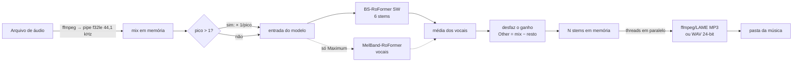

# StemSplitter: documentação completa

Documentação de ponta a ponta do projeto: o que o app faz, como funciona por dentro, quanta qualidade entrega, quão rápido é e por quê, como é empacotado e como continuar desenvolvendo.

O [README](../README.md) é o guia rápido em inglês para quem só quer baixar e usar. Este documento é a referência técnica.

## Sumário

1. [Visão geral](#1-visão-geral)
2. [Funcionalidades](#2-funcionalidades)
3. [Qualidade da separação](#3-qualidade-da-separação)
4. [Desempenho e otimizações](#4-desempenho-e-otimizações)
5. [Arquitetura](#5-arquitetura)
6. [Plataformas, empacotamento e CI](#6-plataformas-empacotamento-e-ci)
7. [Desenvolvimento](#7-desenvolvimento)
8. [Limitações conhecidas](#8-limitações-conhecidas)
9. [Histórico de mudanças](#9-histórico-de-mudanças)

---

## 1. Visão geral

O StemSplitter é um aplicativo desktop para **Windows e macOS** que separa uma música em faixas individuais (*stems*) usando modelos de IA:

| Stem | Conteúdo |
|---|---|
| **Vocals** | Voz principal e backing vocals |
| **Drums** | Bateria e percussão |
| **Bass** | Baixo elétrico, synth bass, 808 |
| **Other** | Todo o resto: melodia e harmonia (guitarras, teclados, synths, cordas…) |
| **Guitar** e **Piano** (opcionais) | Separados de dentro do Other, para quem quer 6 stems |
| **Instrumental** (opcional) | Tudo menos a voz |

Em resumo:

- **Entrada:** MP3, WAV, FLAC, M4A, AAC, OGG, Opus, AIFF ou WMA. Arquivos soltos ou pastas inteiras.
- **Saída:** um arquivo por stem, em MP3 (320, 256 ou 192 kbps) ou WAV 24-bit, numa subpasta por música (`Música/Música - Vocals.mp3`, …).
- **Motor:** BS-RoFormer SW (todos os stems numa passada) e, no preset *Maximum*, também o MelBand-RoFormer para os vocais. Os modelos rodam em PyTorch, na GPU NVIDIA (CUDA) ou Apple (Metal), com fallback automático para a CPU.
- **Interfaces:** janela gráfica (PySide6/Qt), linha de comando (`--cli`) e um autoteste (`--selftest`) usado pelo CI.

---

## 2. Funcionalidades

### 2.1 Interface gráfica

- **Arrastar e soltar** arquivos ou pastas. As pastas são varridas de forma recursiva e só os formatos suportados entram. Arquivos repetidos são ignorados.
- Botões **Add files…**, **Remove selected** e **Clear list**.
- **Fila com status por música:** ⏳ na fila, ▶️ processando (com %), ✅ concluída (com o tempo), ⚠️ erro (com a mensagem), ⏹ cancelada.
- **Reprocessar só o que falhou:** ao clicar em *Split stems* de novo, entram apenas as músicas na fila ou com erro.
- **Lote robusto:** um arquivo corrompido falha sozinho e o resto do lote continua.
- **Barra de progresso e status:** mostra a etapa (decodificação, download do modelo com MB e %, separação, gravação) e o progresso geral.
- **Dispositivo em uso** no rodapé, por exemplo "NVIDIA GPU · RTX 3050 Laptop GPU", "Apple Silicon GPU (Metal)" ou "CPU · 12 threads".
- **Log** que pode ser mostrado ou escondido, com o tempo de cada etapa por música. Ele abre sozinho quando há erro.
- **Cancelar:** para no próximo bloco de áudio processado. Ao fechar a janela no meio de um trabalho, o app pede confirmação.
- **Abrir pasta de saída** com um clique.
- **Configurações lembradas entre sessões:** pasta de saída, qualidade (salva pelo nome do preset), formato, Instrumental, Guitar/Piano e última pasta de entrada.
- **Tema:** estilo Fusion com cor de destaque; no macOS segue o modo escuro do sistema.
- Menu **Help → About** com as versões e os modelos usados.

### 2.2 Presets de qualidade

| Preset | O que roda | Para quem |
|---|---|---|
| **Balanced** (padrão) | BS-RoFormer SW com sobreposição 2 | A melhor relação qualidade/tempo |
| **Maximum** | SW (sobreposição 2) + MelBand-RoFormer (sobreposição 2), com a média dos vocais | Vocais o mais limpos possível; ~1,8× mais lento |
| **Fast** | SW com sobreposição 1 | ~1,8× mais rápido; ainda melhor que a versão antiga do app no modo máximo |

O nome antigo `high` continua aceito, como apelido de `balanced`.

### 2.3 Opções de saída

- **Formato:** MP3 320/256/192 kbps (LAME) ou WAV 24-bit PCM. Cada MP3 leva o título `Música (Stem)` nos metadados.
- **Instrumental:** grava também `mistura − vocais`.
- **Guitar e Piano:** tira guitarra e piano de dentro do Other, sem custo extra de tempo, porque o modelo já produz esses stems na mesma passada.
- **Proteção contra clipping:** se o pico de um stem passar de 0,999, só aquele arquivo é reduzido o suficiente para não distorcer.

### 2.4 Linha de comando

```bash
python main.py --cli musica1.mp3 musica2.flac -o pasta_saida \
    -q balanced|maximum|fast  -b 320  --wav  --instrumental  --guitar-piano
```

Mostra o dispositivo, o progresso e onde cada stem foi gravado. Com várias músicas, a gravação de uma acontece enquanto a próxima é separada (veja a [seção 4.3](#43-otimizações-implementadas)).

### 2.5 Modelos e dados do usuário

- **Os modelos são baixados sozinhos no primeiro uso,** com progresso visível: ~0,7 GB para o SW e mais ~0,9 GB para o MelBand, só se o *Maximum* for usado.
- **Onde ficam:** `%LOCALAPPDATA%\StemSplitter\models` no Windows e `~/Library/Application Support/StemSplitter/models` no macOS.
- **Na mesma pasta de dados:** `stemsplitter.log` (saída dos builds sem console), `selftest.txt` (resultado do autoteste), `numba_cache` (cache do librosa) e `bin/` (cópia do ffmpeg quando o app roda a partir do código-fonte).

### 2.6 Seleção de hardware

- **NVIDIA (CUDA):** o build padrão do Windows já traz o PyTorch com CUDA 13.0 e usa a GPU automaticamente.
- **Apple Silicon (Metal/MPS):** usado automaticamente no Mac. Operações raras sem suporte no MPS caem para a CPU (`PYTORCH_ENABLE_MPS_FALLBACK=1`).
- **CPU:** usada só quando não há GPU compatível.
- **`STEMSPLITTER_THREADS=N`:** fixa o número de threads da CPU, para testes.
- **`STEMSPLITTER_MEMLOG=1`:** registra no log a RAM (e a VRAM, quando o PyTorch está carregado) em cada etapa: worker iniciado, áudio decodificado, modelo carregado, inferência concluída, stems montados, arquivos gravados, fila concluída e worker encerrado.

---

## 3. Qualidade da separação

### 3.1 Modelos

| Modelo | Autor | Papel | Tamanho |
|---|---|---|---|
| **BS-RoFormer SW** (`BS-Roformer-SW.ckpt`) | jarredou | Separa os 6 stems (bass, drums, other, vocals, guitar, piano) numa passada | 0,7 GB |
| **MelBand-RoFormer** (`vocals_mel_band_roformer.ckpt`) | Kimberley Jensen | Segundo modelo de vocais, só no *Maximum* | 0,9 GB |

Os dois são arquiteturas RoFormer (Transformers com *rotary embeddings* sobre o espectrograma), o estado da arte em separação de fontes musicais. Eles são carregados pela biblioteca [python-audio-separator](https://github.com/nomadkaraoke/python-audio-separator) 0.47.0.

**Configuração de inferência do SW:**
- 44,1 kHz, estéreo.
- STFT de 2048 com hop de 512.
- Blocos de 409 600 amostras (9,29 s) com janela Hamming e *overlap-add*.
- Batch 1.
- fp16 na GPU, fp32 na CPU.
- Sem *shifts*: esse conceito é do Demucs e não existe aqui.

### 3.2 Como a qualidade foi medida

- **Dados:** os 50 trechos de teste da amostra pública do **MUSDB18** (7 s cada, ~340 s no total). Cada trecho traz os stems originais, que servem de gabarito.
- **Métrica:** **SDR** (*signal-to-distortion ratio*) global por trecho, `10·log10(‖ref‖² / ‖ref − estimativa‖²)`, e a mediana entre os 50. É o mesmo tipo de métrica usado nos rankings da área (MDX, MVSep). Em dB; mais alto é melhor, e +1 dB já é uma diferença audível.
- **Execução:** pelo próprio app (`engine.split`), numa RTX 3050 Laptop.

### 3.3 Resultados

| Configuração | Vocals | Drums | Bass | Other | **Média** |
|---|---|---|---|---|---|
| **Maximum** | **12,03** | 11,38 | 9,58 | **8,04** | **10,26** |
| **Balanced** | 11,83 | 11,38 | 9,58 | 8,03 | **10,20** |
| **Fast** | 11,54 | 10,92 | 9,11 | 7,69 | **9,81** |
| Versão anterior (MelBand-RoFormer + Demucs `htdemucs_ft`) | 11,30 | 9,77 | 8,76 | 6,72 | 9,14 |

Outras variantes testadas, para referência (mesma métrica):

| Variante | Média | Conclusão |
|---|---|---|
| SW com sobreposição 4 | 10,22 | +0,02 dB pelo dobro do tempo: não vale |
| Blocos do tamanho do treino (13,35 s) | 10,22 | +0,02 dB: não vale |
| SW com o Other "do modelo" em vez do residual | 10,20 | o residual empata ou ganha e ainda garante a soma exata |

### 3.4 Decisões que garantem a qualidade

- **Os stems somam a música exatamente.** O Other é calculado como `mistura − (vocals + drums + bass [+ guitar + piano])`. Medido: ~113 dB de reconstrução com WAV 24-bit, ou seja, o limite da própria precisão de 24 bits. Na versão antiga eram ~16 dB. A única exceção é a proteção contra clipping (seção 2.3): quando ela reduz um arquivo, a soma fica um pouco abaixo; numa música muito alta, medimos 64,7 dB, que ainda é inaudível.
- **Músicas masterizadas alto.** MP3s altos decodificam com picos acima de 1,0; o Daft Punk do teste chega a 1,066. O modelo precisa de pico ≤ 1, então o app reduz a entrada e **aplica o ganho inverso nos stems**. Antes disso, a biblioteca normalizava sozinha e parte de todos os stems acabava no Other. Num teste com pico ~2, a média caía de 10,20 para **3,95 dB**; com a correção, volta a **10,20 dB**.
- **Ensemble de vocais no *Maximum*.** A média de dois modelos fortes rende +0,2 dB nos vocais.
- **fp16 na GPU.** A diferença para fp32 fica ~40 dB abaixo do sinal, inaudível.
- **Nada de reduzir a 16 bits entre as etapas.** Todo o processamento é em float32, e só o arquivo final é codificado.

### 3.5 O que foi descartado por perder qualidade

- **Pular modelos do `htdemucs_ft`** (na versão com Demucs): calcular o Other por subtração colocava +4,7 dB de subgrave nele, e tirar o especialista de vocais colocava +9,7 dB de agudos (chimbal e pratos). Revertido na época.

---

## 4. Desempenho e otimizações

### 4.1 Tempos atuais

Laptop Intel i5-12500H com NVIDIA RTX 3050 Laptop (4 GB). Música de 4 minutos:

| Hardware | Fast | Balanced | Maximum |
|---|---|---|---|
| NVIDIA GPU (RTX 3050 Laptop) | ~30 s | ~1 min | ~1 min 45 s |
| Só CPU (12 núcleos, laptop) | ~20 min | ~28 min | mais lento ainda |

Medido diretamente: uma música de 5:20 em Balanced leva **77 s** com o modelo já carregado, e um lote de 2 músicas leva **156 s**. O carregamento do modelo custa ~3 s, uma vez por sessão. Os tempos de Apple Silicon ainda não foram medidos.

### 4.2 Onde o tempo vai (profiling)

Profiling por etapa, com GPU sincronizada, numa música de 5:20 em Balanced:

| Etapa | Antes das otimizações | Depois |
|---|---|---|
| Forward do modelo (69 blocos) | 72,8 s (78%) | ~69 s (~90%) |
| Encoding MP3 dos 4 stems | 14,8 s (16%, um de cada vez) | ~4,5 s (em paralelo) |
| WAVs intermediários (gravar, reler, normalizar) | ~3,7 s | 0 (tudo em memória) |
| Decodificação do MP3 | 0,4 s | 0,4–0,6 s |
| **Total** | **94 s** | **77 s** |

**Recursos medidos:** pico de RAM de ~3,1 GiB; VRAM alocada pelo PyTorch de ~0,9 GiB (reserva de ~2 GiB); GPU ~87–90% ocupada; CPU com 25–40% de uso médio.

A inferência está **limitada pelo próprio cálculo na GPU**, não por overhead do Python: o custo é linear (~113 ms por segundo de áudio por passada de sobreposição) e a GPU só fica ociosa na gravação. Por isso o principal controle de velocidade é o preset.

### 4.3 Otimizações implementadas

Em ordem cronológica, com o ganho medido:

| # | Otimização | Ganho |
|---|---|---|
| 1 | **GPU por padrão:** o build do Windows passou a ser CUDA, com fallback para a CPU | da ordem de 20× (Balanced: ~1 min na RTX 3050 contra ~28 min na CPU) |
| 2 | **fp16 nativo nos RoFormer** na GPU | mais velocidade e metade da VRAM |
| 3 | `shifts` 2 → 1 no Demucs (versão antiga) | 2× no Demucs |
| 4 | **Troca do Demucs pelo BS-RoFormer SW:** um modelo no lugar de vocal + 4 Demucs | +1,06 dB **e** mais rápido |
| 5 | **Correção da normalização** em músicas altas | qualidade (seção 3.4) |
| 6 | **Encoding dos stems em paralelo** (o LAME só usa um núcleo) | 14,3 s → 4,4 s por música |
| 7 | **Pipeline em memória:** o ffmpeg decodifica por *pipe*, a inferência é chamada direto e não há WAVs intermediários | −4 a 6 s e ~0,8 GB a menos de disco por música |
| 8 | **Lotes sobrepostos:** a música N é gravada numa thread enquanto a N+1 é separada | ~−4 s por música em lote |
| 9 | **Modelos carregados uma vez** por sessão e reaproveitados | ~3 s a menos por música |
| 10 | Progresso do download no primeiro uso | UX |

### 4.4 Testado e descartado

Tudo medido na RTX 3050:

| Ideia | Resultado |
|---|---|
| Processar blocos em lote (batch 2) | 113 → 112 ms/s de áudio: sem ganho (a GPU já está saturada) |
| Batch 4 | 935 ms/s, 8× mais lento: estoura os 4 GB de VRAM |
| `torch.backends.cudnn.benchmark` | sem ganho |
| TF32 | sem ganho (o modelo roda em fp16) |
| `torch.compile` com `triton-windows` 3.8 | a compilação falha dentro da biblioteca no Windows e cai no modo normal; +4 s de carga |
| Blocos de 13,35 s (tamanho de treino) | mesma velocidade, +0,02 dB |
| Número de threads na CPU (4/8/12/16) | o padrão (12) foi o melhor |
| Sobreposição 4 | dobro do tempo para +0,02 dB |
| CUDA graphs | sem sentido com a GPU saturada |
| TensorRT / ONNX Runtime | não tentado: exportar RoFormer (STFT complexa) é um projeto à parte, sem garantia de ganho |
| BF16 / INT8 | BF16 não ganha nada sobre fp16; INT8 arrisca a qualidade |

### 4.5 Escalabilidade e uso de memória

- **Uma GPU, um trabalho por vez.** Duas inferências simultâneas numa GPU de 4 GB disputam a VRAM, o Windows começa a usar a RAM do sistema e tudo fica **várias vezes mais lento**. Isso foi observado com outra instância do app aberta: até 8× mais lento.
- **Pipelining limitado:** no máximo uma música esperando gravação, então a RAM nunca guarda mais que duas músicas de stems. Uma música de 5 min com a mistura e 4 stems em float32 ocupa ~0,5 GB; o pico medido do processo foi ~3,1 GiB, incluindo PyTorch e o modelo.
- **A IA roda num processo separado (worker).** A janela não importa o PyTorch e usa ~50 MB. O worker é criado assim que músicas são adicionadas e já carrega o modelo do preset em segundo plano (só se o modelo já tiver sido baixado; espera até 90 s pelo *Split stems*), o que tira ~6 s da espera. Ele carrega o modelo uma vez para a fila inteira e encerra 30 s depois que a fila termina (`EngineProcess.IDLE_SECONDS`). Só o fim do processo devolve com certeza ao sistema a memória do PyTorch, do CUDA e das bibliotecas C: no mesmo processo, mesmo depois de `engine.close()`, ficavam ~2,1 GB residentes.
- **Uma instância por modelo.** O overlap é só um atributo lido a cada `demix()`, então Balanced e Fast compartilham o mesmo BS-RoFormer. Ao sair do Maximum, o MelBand-RoFormer é descarregado. Antes, alternar entre os presets deixava até 3 instâncias carregadas.
- **Um modelo por vez na VRAM (CUDA).** No Maximum, o modelo ocioso espera na RAM enquanto o outro roda (`_place_on_gpu`); a troca leva uma fração de segundo. Com os dois na GPU de 4 GB, a reserva de VRAM chegava a 4,3 GB, o Windows passava a usar a RAM do sistema e um trecho de 60 s levava ~860 s. Agora leva ~23 s, com reserva de 1,8 GB e saída bit a bit idêntica. No Apple Silicon a memória é única, então nada muda.
- **Menos cópias dos arrays:** só os stems usados são copiados da saída do modelo (o "other" do modelo e, sem a opção, guitar e piano são descartados); a média do Maximum, o ganho das músicas altas e o Other são calculados no próprio buffer; o ffmpeg recebe o buffer do stem direto, sem `tobytes()`. A saída continua bit a bit idêntica.

Medido (RTX 3050 Laptop, música de 5:21, Balanced, WAV + Instrumental):

| | Antes | Depois |
|---|---|---|
| Janela parada | ~53 MB | ~53 MB |
| Pico de RAM do split | 3,81 GB | 3,46 GB |
| RAM depois da fila | ~2,1 GB (retida até fechar o app) | ~60 MB (30 s depois, o worker encerra) |
| Balanced → Fast → Maximum → Balanced no mesmo engine | 3 instâncias, 2,30 GB | 1 instância, 1,67 GB |
- **Na CPU,** a inferência domina ainda mais: ~3,3× o tempo real por passada.

---

## 5. Arquitetura

### 5.1 Arquivos

| Arquivo | Responsabilidade |
|---|---|
| `main.py` | Ponto de entrada: janela (padrão), `--cli` e `--selftest` |
| `stemsplitter/engine.py` | Todo o pipeline de áudio: presets, modelos, decodificação, separação, montagem dos stems e gravação |
| `stemsplitter/gui.py` | Interface PySide6: janela, fila, configurações e o `EngineProcess`, que inicia e encerra o worker |
| `stemsplitter/worker.py` | Processo worker: executa a fila no engine e envia progresso, logs e resultados para a GUI |
| `stemsplitter/memory.py` | Medição de memória para depuração (`STEMSPLITTER_MEMLOG=1`) |
| `stemsplitter/platform_utils.py` | Pastas de dados, ffmpeg embutido, ajustes do app empacotado, abrir pasta |
| `stemsplitter/__init__.py` | Nome e versão do app |
| `StemSplitter.spec` | Receita do PyInstaller |
| `.github/workflows/build.yml` | CI: lint, builds, autoteste, artefatos e release |
| `ruff.toml` | Regras do lint (só erros reais) |
| `tools/make_icon.py` | Gera os ícones em `assets/` |

### 5.2 Fluxo de uma música



As etapas em `engine.py`:

1. **`_decode`:** o ffmpeg converte qualquer formato em float32 estéreo de 44,1 kHz e envia por *pipe* direto para um array NumPy, sem arquivo temporário.
2. **Ganho:** se o pico passar de 1,0, a entrada do modelo é multiplicada por `1/pico`.
3. **`_run_model`:** chama `demix()` do modelo do `audio-separator` diretamente com o array (`canais × amostras`), sem o caminho da biblioteca baseado em arquivos.
4. **Montagem:** desfaz o ganho; Vocals (média dos dois modelos no Maximum), Drums, Bass e, se pedido, Guitar e Piano; Other = mistura − soma; Instrumental opcional.
5. **`write_stems`:** um *pool* de threads codifica todos os stems ao mesmo tempo, com o ffmpeg recebendo o áudio por stdin.

### 5.3 API do engine

```python
from stemsplitter.engine import StemEngine, Options

engine = StemEngine(log=print)            # guarda os modelos carregados entre músicas
opts = Options(output_dir="saida", quality="balanced", bitrate_kbps=320,
               output_format="mp3", also_instrumental=False, guitar_piano=False)

result = engine.separate("musica.mp3", opts, progress=lambda frac, texto: ...)
# ou, para encadear gravação e separação:
sep = engine.split("musica.mp3", opts, progress)       # -> Separated (stems em memória)
result = engine.write_stems(sep, opts, progress)       # -> Result (caminhos + segundos)

engine.prepare_models(progress, quality="maximum")     # baixa/carrega antes (opcional)
engine.close()
```

- `Preset(stem_overlap, vocal_overlap)` define cada preset; `get_preset()` resolve nomes e apelidos.
- `progress(frac, texto)` recebe de 0 a 1 o andamento geral; `cancel` é qualquer objeto com `is_set()` (`threading.Event` ou `multiprocessing.Event`).
- `Cancelled` é a exceção levantada quando o usuário cancela.

### 5.4 Modelo de processos e threads

| Onde | O que faz |
|---|---|
| Processo da GUI, thread principal (Qt) | Janela e eventos; o `EngineProcess` lê a fila de eventos do worker a cada 50 ms e os repassa como sinais |
| Processo worker, thread principal (`worker.serve`) | `engine.split()` de cada música (decodificação e inferência na GPU/CPU) |
| Processo worker, *writer* (1 thread) | `engine.write_stems()` da música anterior e o evento de concluída |
| Processo worker, *pool* de encoders (até N threads) | Um processo ffmpeg/LAME por stem |

- **Comunicação:** duas `multiprocessing.Queue` (contexto *spawn*): comandos `(jobs, opts)` ou `None` (encerrar) para o worker, e eventos `status`, `done`, `failed`, `log`, `device` e `finished` de volta, entregues na ordem de emissão. Atualizações de progresso seguidas da mesma música são agrupadas.
- **Ciclo de vida:** o worker é criado no primeiro *Split stems*, reaproveitado por qualquer fila iniciada nos 30 s seguintes e encerrado depois disso ou ao fechar a janela. Se o processo morrer no meio (falta de memória, falha de driver), as músicas restantes aparecem como falha e a janela continua funcionando.
- **Cancelamento:** um `multiprocessing.Event` compartilhado, verificado entre blocos de inferência (pelo gancho de progresso) e antes de cada arquivo gravado.
- **Empacotado:** o worker é o próprio executável, iniciado pelo `multiprocessing.freeze_support()` em `main.py`. O `--selftest` do CI inicia e encerra um worker para garantir isso.

### 5.5 Progresso e cancelamento

O `audio-separator` informa o progresso via `tqdm`. O engine troca esse `tqdm` por um substituto mínimo (`_HookTqdm`) que:
- repassa o andamento de cada bloco de inferência e do download dos modelos (barras contadas em bytes);
- verifica o cancelamento a cada passo.

O `_bar_tracker` transforma isso num valor 0..1 que só cresce, e as etapas são ponderadas: decodificação 2%, stems 93% (ou 53% + 40% no *Maximum*) e gravação 5%.

### 5.6 Log

O handler do logger `audio_separator` repassa à janela só avisos e mensagens úteis (download, dispositivo) e filtra o ruído, como o aviso de ONNX Runtime, irrelevante porque os dois modelos rodam em PyTorch. Ao fim de cada música entra uma linha com o tempo de cada etapa, por exemplo `Música: 77s (decode 0.6s, stems 70.8s, encode 4.5s)`.

---

## 6. Plataformas, empacotamento e CI

### 6.1 Requisitos

- **Python:** 3.11 recomendado.
- **Dependências (`requirements.txt`):** `audio-separator[cpu]==0.47.0`, `torch>=2.3`, `PySide6==6.11.2`, `imageio-ffmpeg==0.6.0`, `soundfile`, `numpy`.
- **Windows:** 64 bits. Para GPU, placa NVIDIA com driver compatível com CUDA 13.0.
- **macOS:** 14 (Sonoma) ou mais novo, em Apple Silicon. Macs Intel não são suportados porque o PyTorch não publica mais builds para eles.

### 6.2 Empacotamento (`StemSplitter.spec`)

- **Bundle:** PyInstaller em modo pasta (`dist/StemSplitter/`) no Windows e `.app` no macOS. Sem console; a saída vai para `stemsplitter.log`.
- **ffmpeg:** o binário estático do `imageio-ffmpeg` é embutido com o nome `ffmpeg`.
- **Dados e metadados:** os do `audio_separator` (catálogo de modelos), do `librosa` e os metadados de pacotes que leem a própria versão.
- **Exclusões:** pacotes que não são usados (tkinter, matplotlib, torchaudio, triton…) e o **`pkg_resources`**. O setuptools 82+ removeu esse módulo, uma pasta vazia no runner fazia o hook `pyi_rth_pkgres` quebrar o app no macOS, e nada no app precisa dele.
- **Mac:** `Info.plist` com `LSMinimumSystemVersion` 14.0 e suporte a modo escuro.

### 6.3 CI (`.github/workflows/build.yml`)

| Gatilho | O que acontece |
|---|---|
| Push em qualquer branch (exceto commits só de `.md` ou `tools/`) | Lint e os builds com autoteste. Pushes novos no mesmo branch cancelam o build anterior |
| PR de fork | Mesmo processo |
| **Run workflow** manual | Builds com os arquivos para baixar; opção de build só de CPU |
| Tag `v*` | Builds e um GitHub Release |

As etapas:

1. **Lint** (~30 s): `ruff` só com regras de erro real (`E9`, `F`) e `compileall`. Os builds longos só começam se o lint passar.
2. **Builds em matriz:**
   - `Windows-x64`: PyTorch **CUDA 13.0**, usa a GPU NVIDIA e cai para a CPU sem ela.
   - `macOS-AppleSilicon`: PyTorch padrão, com Metal.
   - `Windows-x64-CPU` (opcional): menor, só CPU.
3. **Autoteste do app empacotado:** `StemSplitter --selftest` importa PyTorch e `audio-separator`, roda o ffmpeg e grava `selftest.txt`, que inclui a versão do CUDA. No Mac o app também é assinado ad hoc.
4. **Arquivos para baixar:** zip por plataforma (só em execução manual ou tag).
5. **Release:** o build CUDA do Windows passa de 2 GB, o limite do GitHub Releases, então sai em partes 7-Zip `.7z.001`, `.002`, …

### 6.4 Primeira execução para o usuário final

- **Windows SmartScreen:** o app não é assinado, então é preciso clicar em **Mais informações → Executar assim mesmo**.
- **macOS Gatekeeper:** botão direito → **Abrir**. Se o macOS disser que está "danificado": `xattr -dr com.apple.quarantine /Applications/StemSplitter.app`.

---

## 7. Desenvolvimento

### 7.1 Rodar a partir do código

```bash
python -m venv .venv
# Windows: .venv\Scripts\activate    macOS/Linux: source .venv/bin/activate
pip install -r requirements.txt
# Windows + NVIDIA: o torch do PyPI para Windows é só CPU; troque pelo CUDA:
pip install --force-reinstall --no-deps torch==<mesma versão> --index-url https://download.pytorch.org/whl/cu130
python main.py                       # janela
python main.py --cli musica.mp3 -o saida
python main.py --selftest            # o mesmo teste do CI
```

Build local: `pip install pyinstaller && pyinstaller --noconfirm StemSplitter.spec`. O resultado vai para `dist/`.

### 7.2 Lint

```bash
pip install ruff==0.16.9
ruff check .
python -m compileall -q main.py stemsplitter StemSplitter.spec
```

### 7.3 Como medir qualidade e velocidade

A metodologia da seção 3.2 é fácil de repetir:
1. Baixe a amostra do MUSDB18 (`MUSDB18-7-STEMS.zip`, 147 MB, no Zenodo, registro 3270814).
2. Decodifique os streams de cada `.stem.mp4`: 0 = mistura, 1 = drums, 2 = bass, 3 = other, 4 = vocals.
3. Concatene os 50 trechos de teste, rode `engine.split()` no resultado e calcule o SDR por trecho contra o gabarito.

Para a velocidade, o log já traz o tempo de cada etapa. Para medições finas, sincronize a GPU (`torch.cuda.synchronize()`) antes de cada leitura de tempo e **feche outros programas que usam a GPU**.

### 7.4 Pontos de extensão

- **Novo preset:** acrescente um `Preset` em `QUALITY_PRESETS` (`engine.py`) e uma entrada em `QUALITIES` (`gui.py`).
- **Outro modelo:** qualquer modelo MDXC/RoFormer do catálogo do `audio-separator` pode ser carregado por `_separator()` e executado por `_run_model()`. O resultado é um dicionário `stem → (amostras × canais)`.
- **Novo formato de saída:** em `_write_stem()`.

---

## 8. Limitações conhecidas

- **A separação não é perfeita:** reverb pesado, guitarras distorcidas na região da voz e mixagens muito densas sempre deixam algum vazamento.
- **A CPU é lenta:** ~20–28 min por música de 4 min. A GPU muda tudo.
- **VRAM de 4 GB:** outros programas usando a GPU, inclusive outra cópia do StemSplitter, podem deixar a separação várias vezes mais lenta. No *Maximum*, só o modelo em uso fica na GPU.
- **Primeira passada do modelo de vocais:** em alguns testes, numa sessão nova, ela levou ~45 s a mais que as seguintes. A causa não foi confirmada e não se repetiu em todas as medições.
- **Apple Silicon:** funciona, mas os tempos ainda não foram medidos.
- **Apps sem assinatura:** para distribuição pública seriam necessários um Apple Developer ID (com notarização) e um certificado de assinatura no Windows.
- **Licenças:** o código é do projeto. Componentes: python-audio-separator (MIT), PyTorch (BSD), PySide6/Qt (LGPL-3, link dinâmico), FFmpeg (GPL; inclua a licença e o link do código-fonte se distribuir) e os modelos (confira a licença de cada um antes de uso comercial).

---

## 9. Histórico de mudanças

| Commit | Mudança |
|---|---|
| `8de7ad7` | Versão inicial: MelBand-RoFormer + Demucs `htdemucs_ft`, build CPU no Windows |
| `278659a` | GPU por padrão (build CUDA), fp16 nos vocais, `shifts` 2 → 1, presets Maximum/Fast, tempos no log |
| `5d57e0b` | Correção do build do macOS (`pkg_resources` excluído do PyInstaller) |
| `9b1f112` | CI em todo commit: lint, builds e autoteste |
| `b85805c` | Demucs trocado pelo **BS-RoFormer SW**: +1,06 dB e mais rápido; presets Balanced/Maximum/Fast; 6 stems opcionais; soma exata |
| `2539551` | Otimizações guiadas por profiling: correção para músicas altas, encoding paralelo, pipeline em memória, lotes sobrepostos, progresso do download (94 s → 77 s) |
