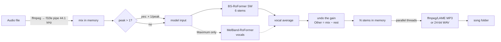

# StemSplitter: full documentation

End-to-end documentation of the project: what the app does, how it works inside, how much quality it delivers, how fast it is and why, how it is packaged, and how to keep developing it.

The [README](../README.md) is the quick guide for people who just want to download and use the app. This document is the technical reference.

## Contents

1. [Overview](#1-overview)
2. [Features](#2-features)
3. [Separation quality](#3-separation-quality)
4. [Performance and optimizations](#4-performance-and-optimizations)
5. [Architecture](#5-architecture)
6. [Platforms, packaging and CI](#6-platforms-packaging-and-ci)
7. [Development](#7-development)
8. [Known limitations](#8-known-limitations)
9. [Change history](#9-change-history)

---

## 1. Overview

StemSplitter is a desktop app for **Windows and macOS** that splits a song into individual tracks (*stems*) using AI models:

| Stem | Contents |
|---|---|
| **Vocals** | Lead and backing vocals |
| **Drums** | Drum kit and percussion |
| **Bass** | Bass guitar, synth bass, 808 |
| **Other** | Everything else: melody and harmony (guitars, keys, synths, strings…) |
| **Guitar** and **Piano** (optional) | Split out of Other, for 6 stems |
| **Instrumental** (optional) | Everything except the vocals |

In short:

- **Input:** MP3, WAV, FLAC, M4A, AAC, OGG, Opus, AIFF or WMA. Single files or whole folders.
- **Output:** one file per stem, as MP3 (320, 256 or 192 kbps) or 24-bit WAV, in one subfolder per song (`Song/Song - Vocals.mp3`, …).
- **Engine:** BS-RoFormer SW (all stems in one pass) and, in the *Maximum* preset, also MelBand-RoFormer for the vocals. The models run on PyTorch, on the NVIDIA (CUDA) or Apple (Metal) GPU, with an automatic fallback to the CPU.
- **Interfaces:** a desktop window (PySide6/Qt), a command line (`--cli`) and a self-test (`--selftest`) used by CI.
- **Memory:** the app never takes the memory the system needs to stay responsive. It speeds up when memory is free and slows down or waits when it is short, without losing work ([section 4.6](#46-memory-governor)).

---

## 2. Features

### 2.1 Desktop window

A dark window with a purple accent, built like an audio production tool: a sidebar on the left (**Split**, **Batch**, **Settings**, **About**) and the page on the right, with the processing card and a status bar always at the bottom. It opens at 1400×850 (minimum 1100×700, both reduced to fit smaller screens) and every part follows the window's width. There is no menu bar.

- **Split page:** title, a large drag & drop area, the *Files to process* card, the *Output Settings* card and the log; the page scrolls when the window is short.
- **Drag and drop** files or folders onto the drop area or the list. Folders are scanned recursively and only supported formats are added. Duplicate files are ignored. While something is dragged over the drop area, its border and background light up.
- **Add Files** and **Add Folder** buttons in the drop area (*Add Folder* adds a folder exactly like dropping it). *Remove selected* and *Clear list* in the queue's header, and an × on every row.
- **Queue with a status per song:** each row has a checkbox (it selects the row, like a click; Ctrl/Shift+click also work), the file name (shortened with "…" when it doesn't fit, full path in the tooltip), its format, size and folder, and its state with an icon and text: *Queued* (clock), *Processing…* (purple progress ring, "27% · 1m 48s remaining"), *Completed* (green check, "done in 1m 12s"), *Failed* (red mark and the error), *Cancelled* (stop mark, "resumes where it stopped"). The list shows up to 6 rows and scrolls beyond that; with no songs it shows a small empty state.
- **Retry only what failed:** pressing *Split Stems* again only picks up queued, cancelled or failed songs.
- **Preloaded model:** when songs are added, PyTorch and the preset's model start loading in the background, so *Split Stems* starts almost at once.
- **Robust batches:** a broken file fails on its own and the rest of the batch keeps going.
- **Output Settings card:** *Save stems to* with *Browse…*, *Quality* with a one-line description of the selected preset, *Output format*, and the Instrumental and Guitar/Piano options. Two columns when the window is wide enough, one column otherwise.
- **Processing card:** idle, it sums up what *Split Stems* will do ("3 songs to split · Balanced (recommended) · MP3 · 320 kbps") next to the *Split Stems* button. While a queue runs, it shows the song being separated, the stage (decoding, model download with MB, separation, writing, waiting for memory), an animated progress bar, the percentage and the time left, and *Cancel* takes the place of *Split Stems*. When song N is being written while song N+1 is separated, the card follows song N+1 and each row keeps its own progress. At the end it shows the result ("All done — 3 song(s) split", "Finished with 1 error(s) — see the log" or "Cancelled").
- **Time left:** estimated in the window from the song's own progress rate since its separation started; the time spent starting the engine, loading or downloading a model or waiting for memory is left out. Nothing is shown during the first 5 s or the first 2% of a song.
- **Status bar:** the device in use (for example "Processing on: NVIDIA GPU · NVIDIA GeForce RTX 3050 Laptop GPU", "Apple Silicon GPU (Metal)" or "CPU · 12 threads"; before the engine starts, "Device: detected when songs are added"), the memory in use while a queue runs, and the queue summary ("3 files | 2 completed | 1 processing | 1 failed").
- **Log** that can be shown or hidden (*Show log* in the processing card), with the time of every stage per song. It opens by itself when there is an error.
- **Cancel:** stops at the next processed block of audio. Closing the window in the middle of a job asks for confirmation.
- **Open output folder** with one click, in the processing card. On narrow windows, *Show log* and *Open output folder* show only their icon (with a tooltip).
- **Locked while running:** as before, the queue can't be changed (no removing or clearing; the row × buttons are disabled) and the options are disabled; *Add Files* and *Add Folder* too. Songs can still be dropped onto the window.
- **Batch page:** how the queue handles many songs, with *Add Folder* and *Go to Split* buttons. **Settings page:** *Keep free for the system*, how much memory StemSplitter must always leave to the rest of the computer (Automatic, or 1–8 GB), and *Ignore the memory limit*, which switches the limit off (the reserve is then greyed out). The window ships with *Ignore the memory limit* **ticked**: untick it to apply the reserve. See [section 4.6](#46-memory-governor). **About page:** version, models and licenses.
- **Memory in use** in the status bar while a queue runs, for example "Memory: 1.4 GB · limit 2.3 GB". When memory is short, the song's stage says "Waiting for free memory (N MB more needed)…" and the work continues as soon as memory frees up.
- **Nothing is lost on a crash:** if the separation process dies (for example, the system ends it when memory runs out), the window starts it again and every song continues from its last checkpoint. A cancelled song also continues where it stopped when it is split again.
- **Settings remembered between sessions:** output folder, quality (saved by preset name), format, Instrumental, Guitar/Piano, the memory reserve and the last input folder. The keys are the same as before the redesign, so existing settings carry over.
- **Look:** Qt's Fusion style with a style sheet built from the tokens in `stemsplitter/ui/theme.py` (colors, type sizes, spacing, radii), the same dark theme on every OS, and a dark title bar on Windows 11 and macOS (Qt 6.8+ color scheme). Font: Inter when installed, otherwise Segoe UI Variable / Segoe UI on Windows and the system font on macOS; no font is bundled. Icons are one outline family drawn from inline SVG (`stemsplitter/ui/icons.py`), with no icon files.

### 2.2 Quality presets

| Preset | What runs | For whom |
|---|---|---|
| **Balanced** (default) | BS-RoFormer SW with overlap 2 | The best quality/time trade-off |
| **Maximum** | SW (overlap 2) + MelBand-RoFormer (overlap 2), with the two vocal estimates averaged | The cleanest possible vocals; ~1.8× slower (measured before the one-model-at-a-time VRAM change; see [4.1](#41-current-timings)) |
| **Fast** | SW with overlap 1 | ~1.8× faster; still better than the old version of the app at its best setting |

The old name `high` is still accepted, as an alias of `balanced`.

### 2.3 Output options

- **Format:** MP3 320/256/192 kbps (LAME) or 24-bit PCM WAV. Every MP3 gets the title `Song (Stem)` in its metadata.
- **Instrumental:** also writes `mix − vocals`.
- **Guitar and Piano:** takes guitar and piano out of Other at no extra time, because the model already produces those stems in the same pass.
- **Clipping protection:** if a stem's peak goes above 0.999, only that file is turned down just enough not to distort.

### 2.4 Command line

```bash
python main.py --cli song1.mp3 song2.flac -o output_folder \
    -q balanced|maximum|fast  -b 320  --wav  --instrumental  --guitar-piano  --reserve-mb 2048  --no-memory-limit
```

`--reserve-mb` is the memory the system must keep free (default: automatic); `--no-memory-limit` ignores the limit (see [section 4.6](#46-memory-governor)). It prints the device, the progress and where each stem was written. With several songs, one song is written while the next one is separated (see [section 4.3](#43-optimizations-in-place)).

### 2.5 Models and user data

- **The models download themselves on first use,** with visible progress: ~0.7 GB for SW, plus ~0.9 GB for MelBand, only if *Maximum* is used.
- **Where they live:** `%LOCALAPPDATA%\StemSplitter\models` on Windows and `~/Library/Application Support/StemSplitter/models` on macOS.
- **In the same data folder:** `stemsplitter.log` (output of the builds without a console), `selftest.txt` (self-test result), `numba_cache` (librosa's cache), `bin/` (a copy of ffmpeg when the app runs from source) and `work/`, one folder per song being split (its audio and checkpoint; removed as soon as the song's files are written, and after 7 days if the song is never split again).
- **Disk space while splitting:** about 21 MB per minute of song per track in `work/`, up to ~14 tracks for 6 stems + Instrumental in *Maximum*, so roughly 0.3 GB per minute of song at most (~1.2 GB for a 4-minute song). The app checks the free space after decoding.

### 2.6 Hardware selection

- **NVIDIA (CUDA):** the default Windows build ships PyTorch with CUDA 13.0 and uses the GPU automatically.
- **Apple Silicon (Metal/MPS):** used automatically on the Mac. Rare operations without MPS support fall back to the CPU (`PYTORCH_ENABLE_MPS_FALLBACK=1`).
- **CPU:** used only when there is no compatible GPU.
- **`STEMSPLITTER_THREADS=N`:** pins the number of CPU threads, for testing.
- **`STEMSPLITTER_MEM_RESERVE_MB=N`:** sets the memory reserve (overrides the automatic one; the setting on the window's Settings page overrides this).
- **`STEMSPLITTER_MEMLOG=1`:** logs the RAM (and the VRAM, once PyTorch is loaded) at every stage: worker started, audio decoded, model loaded, inference done, stems assembled, files written, queue finished and worker stopped.

---

## 3. Separation quality

### 3.1 Models

| Model | Author | Role | Size |
|---|---|---|---|
| **BS-RoFormer SW** (`BS-Roformer-SW.ckpt`) | jarredou | Splits the 6 stems (bass, drums, other, vocals, guitar, piano) in one pass | 0.7 GB |
| **MelBand-RoFormer** (`vocals_mel_band_roformer.ckpt`) | Kimberley Jensen | Second vocal model, *Maximum* only | 0.9 GB |

Both are RoFormer architectures (Transformers with *rotary embeddings* over the spectrogram), the state of the art in music source separation. They are loaded through the [python-audio-separator](https://github.com/nomadkaraoke/python-audio-separator) 0.47.0 library.

**SW inference settings:**
- 44.1 kHz, stereo.
- 2048-point STFT with a hop of 512.
- Blocks of 409,600 samples (9.29 s) with a Hamming window and *overlap-add*.
- Batch 1.
- fp16 on the GPU, fp32 on the CPU.
- No *shifts*: that concept belongs to Demucs and doesn't exist here.

### 3.2 How quality was measured

- **Data:** the 50 test excerpts of the public **MUSDB18** sample (7 s each, ~340 s in total). Each excerpt comes with its original stems, which serve as the ground truth.
- **Metric:** global **SDR** (*signal-to-distortion ratio*) per excerpt, `10·log10(‖ref‖² / ‖ref − estimate‖²)`, and the median over the 50. It is the same kind of metric used by the field's leaderboards (MDX, MVSep). In dB; higher is better, and +1 dB is already an audible difference.
- **How it ran:** through the app itself (`engine.split`), on an RTX 3050 Laptop.

### 3.3 Results

| Setup | Vocals | Drums | Bass | Other | **Average** |
|---|---|---|---|---|---|
| **Maximum** | **12.03** | 11.38 | 9.58 | **8.04** | **10.26** |
| **Balanced** | 11.83 | 11.38 | 9.58 | 8.03 | **10.20** |
| **Fast** | 11.54 | 10.92 | 9.11 | 7.69 | **9.81** |
| Previous version (MelBand-RoFormer + Demucs `htdemucs_ft`) | 11.30 | 9.77 | 8.76 | 6.72 | 9.14 |

Other variants tested, for reference (same metric):

| Variant | Average | Conclusion |
|---|---|---|
| SW with overlap 4 | 10.22 | +0.02 dB for twice the time: not worth it |
| Training-size blocks (13.35 s) | 10.22 | +0.02 dB: not worth it |
| SW with the model's own Other instead of the residual | 10.20 | the residual ties or wins, and also guarantees the exact sum |

### 3.4 Decisions that protect quality

- **The stems add up to the song exactly.** Other is computed as `mix − (vocals + drums + bass [+ guitar + piano])`. Measured: ~113 dB of reconstruction with 24-bit WAV, which is the limit of 24-bit precision itself. The old version reached ~16 dB. The only exception is the clipping protection (section 2.3): when it turns a file down, the sum comes out slightly lower; on a very loud song we measured 64.7 dB, still inaudible.
- **Loudly mastered songs.** Loud MP3s decode with peaks above 1.0; the Daft Punk song used in the tests reaches 1.066. The model needs a peak ≤ 1, so the app turns the input down and **applies the inverse gain to the stems**. Before that, the library normalized on its own and part of every stem ended up in Other. On a test with a peak of ~2, the average dropped from 10.20 to **3.95 dB**; with the fix it is back to **10.20 dB**.
- **Vocal ensemble in *Maximum*.** Averaging two strong models gives +0.2 dB on the vocals.
- **fp16 on the GPU.** The difference from fp32 sits ~40 dB below the signal, inaudible.
- **No reduction to 16 bits between stages.** All processing is float32, and only the final file is encoded.

### 3.5 Dropped because it cost quality

- **Skipping models of `htdemucs_ft`** (in the Demucs version): computing Other by subtraction put +4.7 dB of sub-bass into it, and removing the vocal specialist put +9.7 dB of highs (hi-hats and cymbals) into it. Reverted at the time.

---

## 4. Performance and optimizations

### 4.1 Current timings

Laptop with an Intel i5-12500H and an NVIDIA RTX 3050 Laptop (4 GB). 4-minute song:

| Hardware | Fast | Balanced | Maximum |
|---|---|---|---|
| NVIDIA GPU (RTX 3050 Laptop) | ~30 s | ~1 min | ~1 min 45 s |
| CPU only (12 cores, laptop) | ~20 min | ~28 min | slower still |

Measured directly: a 5:20 song in Balanced takes **77 s** with the model already loaded, and a batch of 2 songs takes **156 s**. Loading the model costs ~3 s and, since the preloading, usually happens before *Split Stems* is pressed. Apple Silicon timings have not been measured yet.

The *Maximum* time was measured before it started keeping only one model at a time in VRAM ([section 4.5](#45-scalability-and-memory-use)) and should now be lower. On a 60 s clip it now takes ~1.5× the Balanced time, but a full song still has to be measured. Since the streaming engine ([4.6](#46-memory-governor)) a 2:52 song in Balanced took 51.8 s, against 66.1 s with the previous engine, measured back to back on the same laptop; these timings were not re-measured for a 4-minute song.

### 4.2 Where the time goes (profiling)

Per-stage profiling, with the GPU synchronized, on a 5:20 song in Balanced:

| Stage | Before the optimizations | After |
|---|---|---|
| Model forward pass (69 blocks) | 72.8 s (78%) | ~69 s (~90%) |
| MP3 encoding of the 4 stems | 14.8 s (16%, one at a time) | ~4.5 s (in parallel) |
| Intermediate WAVs (write, read back, normalize) | ~3.7 s | 0 (all in memory) |
| MP3 decoding | 0.4 s | 0.4–0.6 s |
| **Total** | **94 s** | **77 s** |

**Measured resources:** RAM peak of ~3.1 GiB; VRAM allocated by PyTorch of ~0.9 GiB (~2 GiB reserved); GPU ~87–90% busy; CPU at 25–40% on average.

Inference is **bound by the GPU computation itself**, not by Python overhead: the cost is linear (~113 ms per second of audio per overlap pass) and the GPU is only idle while writing. That is why the preset is the main speed control.

### 4.3 Optimizations in place

In chronological order, with the measured gain:

| # | Optimization | Gain |
|---|---|---|
| 1 | **GPU by default:** the Windows build became CUDA, with a fallback to the CPU | around 20× (Balanced: ~1 min on the RTX 3050 versus ~28 min on the CPU) |
| 2 | **Native fp16 in the RoFormers** on the GPU | more speed and half the VRAM |
| 3 | `shifts` 2 → 1 in Demucs (old version) | 2× in Demucs |
| 4 | **Demucs replaced by BS-RoFormer SW:** one model instead of vocal + 4 Demucs | +1.06 dB **and** faster |
| 5 | **Normalization fix** for loud songs | quality (section 3.4) |
| 6 | **Stems encoded in parallel** (LAME only uses one core) | 14.3 s → 4.4 s per song |
| 7 | **In-memory pipeline:** ffmpeg decodes through a *pipe*, inference is called directly and there are no intermediate WAVs | −4 to 6 s and ~0.8 GB less disk traffic per song |
| 8 | **Overlapping batches:** song N is written on a thread while N+1 is separated | ~−4 s per song in a batch |
| 9 | **Models loaded once** per session and reused | ~3 s less per song |
| 10 | Download progress on first use | UX |
| 11 | **Worker process:** the AI runs in a process that quits 30 s after the queue | RAM after the queue: ~2.1 GB → ~60 MB |
| 12 | **One instance per model** (the overlap is set on the loaded instance) | up to 3 → 1 instance when switching presets |
| 13 | **Fewer array copies** and encoding without `tobytes()` | split peak: 3.81 → 3.46 GB |
| 14 | **One model at a time in VRAM** in *Maximum* (CUDA) | 60 s clip on a 4 GB GPU: ~860 s → ~23 s |
| 15 | **Worker preloading** when songs are added | ~6 s less waiting per queue |
| 16 | **Streaming inference:** each sample is finished and written to a file as soon as no later chunk covers it | memory no longer grows with the song's length |
| 17 | **Work files with plain file I/O** instead of arrays or memory maps | the audio sits in the OS file cache, which the OS gives back first |
| 18 | **Memory governor:** budget = used + available − reserve, recomputed every 250 ms | never eats into the memory the system needs ([4.6](#46-memory-governor)) |
| 19 | **Checkpoints** per song and **automatic restart** of a crashed worker | no work lost on a crash, a cancel or a lack of memory |

The details and measurements of items 11 to 15 are in [section 4.5](#45-scalability-and-memory-use) and those of 16 to 19 in [section 4.6](#46-memory-governor). All of them keep the output bit-identical.

### 4.4 Tried and dropped

All measured on the RTX 3050:

| Idea | Result |
|---|---|
| Processing blocks in batches (batch 2) | 113 → 112 ms per second of audio: no gain (the GPU is already saturated) |
| Batch 4 | 935 ms/s, 8× slower: overflows the 4 GB of VRAM |
| `torch.backends.cudnn.benchmark` | no gain |
| TF32 | no gain (the model runs in fp16) |
| `torch.compile` with `triton-windows` 3.8 | compilation fails inside the library on Windows and falls back to normal mode; +4 s of loading |
| 13.35 s blocks (training size) | same speed, +0.02 dB |
| Number of CPU threads (4/8/12/16) | the default (12) was the best |
| Overlap 4 | twice the time for +0.02 dB |
| CUDA graphs | pointless with a saturated GPU |
| TensorRT / ONNX Runtime | not tried: exporting a RoFormer (complex STFT) is a project of its own, with no guaranteed gain |
| BF16 / INT8 | BF16 gains nothing over fp16; INT8 risks the quality |

### 4.5 Scalability and memory use

- **One GPU, one job at a time.** Two simultaneous inferences on a 4 GB GPU fight over the VRAM, Windows starts using system RAM and everything becomes **several times slower**. This was seen with a second copy of the app open: up to 8× slower.
- **Bounded pipelining:** at most one song waits to be written, and only while the memory governor's headroom is relaxed ([4.6](#46-memory-governor)); otherwise songs go one at a time. The stems themselves are in files, not in RAM.
- **The AI runs in a separate process (worker).** The window doesn't import PyTorch and uses ~83 MB (working set, idle, empty queue; measured after the redesign of the window, see the note below the table). The worker is created as soon as songs are added and loads the preset's model in the background (only if the model is already downloaded; it waits up to 90 s for *Split Stems*), which takes ~6 s off the wait. It loads the model once for the whole queue and quits 30 s after the queue is done (`EngineProcess.IDLE_SECONDS`). Only ending the process reliably gives the memory of PyTorch, CUDA and the C libraries back to the system: in the same process, ~2.1 GB stayed resident even after `engine.close()`.
- **One instance per model.** The overlap is just an attribute read on every `demix()`, so Balanced and Fast share the same BS-RoFormer. Leaving Maximum unloads MelBand-RoFormer. Before, switching between presets left up to 3 instances loaded.
- **One model at a time in VRAM (CUDA).** In Maximum, the idle model waits in RAM while the other one runs (`_place_on_gpu`); the swap takes a fraction of a second. With both on the 4 GB GPU, the VRAM reservation reached 4.3 GB, Windows started using system RAM and a 60 s clip took ~860 s. It now takes ~23 s, with 1.8 GB reserved and bit-identical output. On Apple Silicon the memory is shared, so nothing changes there.
- **On the CPU,** inference dominates even more: ~3.3× real time per pass.
- **Fewer copies:** only the stems in use are written out of the model's output (the model's own "other" and, without the option, guitar and piano are dropped); the Maximum average, the gain for loud songs and Other are computed in place on 10 s blocks; ffmpeg receives each block's own buffer, without `tobytes()`. The output is still bit-identical.

Measured when the worker process was introduced (`f275d9b`, before the streaming engine of [4.6](#46-memory-governor); RTX 3050 Laptop, 5:21 song, Balanced, WAV + Instrumental):

| | Before | After |
|---|---|---|
| Idle window | ~53 MB | ~53 MB |
| Split RAM peak | 3.81 GB | 3.46 GB |
| RAM after the queue | ~2.1 GB (held until the app closed) | ~60 MB (the worker quits 30 s later) |
| Balanced → Fast → Maximum → Balanced in the same engine | 3 instances, 2.30 GB | 1 instance, 1.67 GB |

The idle window was measured again for the redesigned window (Windows 11, Python 3.13, PySide6 6.11.2, i5-12500H, empty queue, 1400×850, median of 10 samples taken 3–12 s after opening, 3 runs each): the previous window **~70 MB** working set (~34 MB private), the redesigned one **~83 MB** (~46 MB private). The extra ~13 MB is QtSvg and the larger widget tree. The ~53 MB in the table comes from `f275d9b` under different conditions and was not measured again on that setup.

### 4.6 Memory governor

The goal: the app never takes the memory the system needs to stay responsive, uses what is free to go fast, and never loses work when memory runs short. Three parts make this possible.

**1. Streaming engine (`engine.py`).** The library's `demix()` held the whole song and every stem in memory (the overlap-add sum and counter buffers), so memory grew with the song's length. The engine now runs the same loop itself: same chunk schedule, Hamming window, overlap-add, counter and division, in the same order, so the output is **bit-identical**. The difference is that every sample is divided out and written to the song's work folder as soon as no later chunk covers it. The decoded mix, the models' outputs and the final stems are raw float32 files (`_Track`), read and written block by block (10 s). Plain file I/O on purpose: a memory map's pages count against the process (on Windows they leave "available" memory altogether), which made the governor wait for memory the app itself was holding; the file cache is counted as available by every OS and dropped first. Assembling the stems (vocal average, gain, `Other = mix − rest`, Instrumental) and encoding also run block by block.

**2. The governor (`memgov.py`).** A thread samples the memory every 250 ms:

> **budget = what the app uses now + memory the system has available − reserve**
> **headroom = budget − what the app uses now = available − reserve**

- **Reserve:** what the system must keep free. Automatic: 2 GB, or a quarter of the RAM on machines with less than 8 GB. The user can pick 1–8 GB on the window's Settings page (`--reserve-mb` in the CLI). Examples: 5 GB available and a 2 GB reserve → the app may take 3 GB more; 3 GB available → 1 GB.
- **macOS:** the kernel's memory pressure level (`kern.memorystatus_vm_pressure_level`) also counts: "warning" limits the headroom to below 512 MB and "critical" makes it negative, because macOS compresses memory before "available" drops.
- **Before every step that needs memory** (loading a model, each inference chunk, each encoder) the engine calls `wait(need)`. The cost of a chunk is measured on the machine as it runs (how far available memory dropped during the previous chunk), and the cost of loading a model is measured the first time it loads (0.70 GB model: ~0.76 GB; 0.91 GB model: ~0.74–0.97 GB).
- **What it changes, by headroom:**

| Headroom | Level | What happens |
|---|---|---|
| ≥ 2 GB | relaxed | Everything in parallel: writing a song while the next one is separated, one encoder per stem, both *Maximum* models kept loaded |
| ≥ 512 MB | normal | One song at a time, at most 2 encoders |
| > 0 | tight | 1 encoder, GPU/allocator caches emptied after each chunk, the model not in use is unloaded (reloaded when needed) |
| ≤ 0 | over | Frees what it can, then **waits** before the next step, keeping all the work done, until other programs free memory |

- **Apple GPU:** PyTorch is capped (`torch.mps.set_per_process_memory_fraction`) at what the budget allows, so it raises an out-of-memory error instead of pushing macOS into swap. A chunk that runs out of memory (on any device) is retried after freeing caches and waiting, up to 12 times with growing waits; nothing of that chunk was added yet, so the result is unchanged.
- **Preloading** a model when songs are added only happens if it fits the budget; it never waits.
- **Ignoring the limit** (*Ignore the memory limit* on the Settings page, `--no-memory-limit` in the CLI, `Options.ignore_memory_limit`, `MemoryGovernor.set_unlimited()`): the headroom is reported as endless (`UNLIMITED`, 1 PB), so the reserve and the macOS pressure level are ignored, `wait()` returns at once, nothing is unloaded or emptied early, preloading always happens and the level is always *relaxed* (everything in parallel). The Apple GPU cap is removed (`set_per_process_memory_fraction(0.0)`, PyTorch's "no limit"). The governor keeps sampling, so the status bar still shows the memory used ("no limit" instead of the budget). A chunk that really runs out of memory is still retried, but nothing stops the app from pushing the system into swap or being ended by the OS; a split ended that way resumes from its checkpoint. In the window it is **on by default** (a new install, or one that never saved the setting, starts with the box ticked); in the CLI and the engine API it is off unless `--no-memory-limit` / `ignore_memory_limit=True` is given. The output is the same either way (the governor only decides when steps run, not what they compute); its speed and memory have not been measured separately.

**3. Checkpoints and restart.** Each song has a work folder (`work/<key>/`, the key covers the file, its size and date, and the options that change the stems) with a `state.json`. The model passes save their position and overlap buffers every 15 s; decoding, each model pass, the assembly and each written file are recorded as they finish. A song that is split again (after a cancel, a crash, or a reboot) continues from there. If the worker process dies in the middle of a queue, the window restarts it (up to 3 times per queue) with the songs that were left. Measured: a split killed (`kill -9`) at 0:51 of a 2:52 song resumed at 0:51 and its files were bit-identical to an uninterrupted run; in the window, a worker killed at 56% was restarted and the song finished.

**Measured** (RTX 3050 Laptop, 24 GB of RAM with ~3–5 GB available because of other programs, the same script for both engines, files compared byte for byte):

| Case | Previous engine | Streaming engine + governor | Output |
|---|---|---|---|
| 2:52 song, Balanced, WAV + Instrumental | 66.1 s, RSS peak 2,342 MB | 51.8 s, 1,768 MB | identical |
| 60 s loud clip (peak 1.5), Maximum, 6 stems, MP3 | 45.6 s, 2,696 MB | 32.6 s, 2,649 MB | identical |
| 6 s clip (short-audio path), Fast | 3.7 s, 1,660 MB | 2.5 s, 1,944 MB | identical |
| 60 s clip, Fast, 6 stems + Instrumental, MP3 | 9.7 s, 1,687 MB | 9.0 s, 1,708 MB | identical |
| CPU only (CUDA hidden), 6 s clip, Fast | — | — | identical |

With memory to spare, *Maximum* still peaks about as high as before: with a relaxed headroom it keeps the stem model in RAM while the vocal model loads, to save reloading it. That is the intended trade-off (use free memory to go fast). The peaks of the short clips include what the process kept from the case before; they are within the budget either way. With memory short (2.3–3.4 GB available, 2 GB reserve), the same *Maximum* run unloaded the stem model before loading the vocal model, waited 10–20 s for memory twice and finished, with the RSS between 1.2 and 1.6 GB.

**The floor.** PyTorch, one model and one chunk must fit at the same time. On the CUDA build that measured ~1.2–1.5 GB of RAM (the model itself in VRAM); on Apple Silicon it has not been measured. Below the floor the app cannot make progress: it waits, says so in the status, and continues when memory frees up, instead of stalling the computer or losing work.

---

## 5. Architecture

### 5.1 Files

| File | Responsibility |
|---|---|
| `main.py` | Entry point: window (default), `--cli` and `--selftest` |
| `stemsplitter/engine.py` | The whole audio pipeline: presets, models, decoding, separation, stem assembly and writing |
| `stemsplitter/gui.py` | The window's logic (queue, settings, run, progress) and the `EngineProcess`, which starts and stops the worker |
| `stemsplitter/ui/theme.py` | Design tokens (colors, type sizes, spacing, radii, window sizes) and the Qt style sheet built from them |
| `stemsplitter/ui/icons.py` | The outline icon set and the app mark, drawn from inline SVG with QtSvg |
| `stemsplitter/ui/widgets.py` | The window's components: `Sidebar`, `DropZone`, `FileQueue`/`FileList`/`FileRow`, `OutputSettings`, `ProcessingPanel`, `StatusBar` and small helpers. They show state and emit signals; they don't know about the engine |
| `stemsplitter/ui/pages.py` | The Batch, Settings and About pages |
| `stemsplitter/worker.py` | Worker process: runs the queue on the engine and sends progress, logs and results to the GUI |
| `stemsplitter/memgov.py` | The memory governor: budget, levels, waiting, macOS memory pressure ([4.6](#46-memory-governor)) |
| `stemsplitter/memory.py` | Memory measurement for debugging (`STEMSPLITTER_MEMLOG=1`) |
| `stemsplitter/platform_utils.py` | Data folders, bundled ffmpeg, packaged-app tweaks, opening folders |
| `stemsplitter/__init__.py` | App name and version |
| `StemSplitter.spec` | PyInstaller recipe |
| `.github/workflows/build.yml` | CI: lint, builds, self-test, artifacts and releases |
| `ruff.toml` | Lint rules (real errors only) |
| `CLAUDE.md` | Project rules for Claude Code: everything in English, and every relevant change documented |
| `tools/make_icon.py` | Generates the icons in `assets/` |

### 5.2 Flow of one song



The stages in `engine.py`:

1. **`_decode`:** ffmpeg turns any format into 44.1 kHz stereo float32 and pipes it straight into a NumPy array, with no temporary file.
2. **Gain:** if the peak is above 1.0, the model input is multiplied by `1/peak`.
3. **`_stream_model`:** runs the `audio-separator` model chunk by chunk with the library's own demix loop, writing every finished sample to the song's work folder ([4.6](#46-memory-governor)).
4. **`_assemble`:** block by block, undoes the gain; Vocals (the average of the two models in Maximum), Drums, Bass and, if requested, Guitar and Piano; Other = mix − sum; optional Instrumental; and each stem's peak for the clipping protection.
5. **`write_stems`:** encodes the stems in parallel (as many at once as the governor allows), streaming each one to ffmpeg's stdin block by block; each file is written under a `.part` name and renamed when complete.

`_decode`, `_stream_model`, `_assemble` and `write_stems` all read and write the work folder through `_Track` (10 s blocks), so a song never has to fit in memory.

### 5.3 Engine API

```python
from stemsplitter.engine import StemEngine, Options

engine = StemEngine(log=print)            # keeps the loaded models between songs; starts its own memory governor
opts = Options(output_dir="output", quality="balanced", bitrate_kbps=320,
               output_format="mp3", also_instrumental=False, guitar_piano=False,
               memory_reserve_mb=0,       # 0 = automatic reserve
               ignore_memory_limit=False) # True = the governor never waits or holds back

result = engine.separate("song.mp3", opts, progress=lambda frac, text: ...)
# or, to overlap writing and separation:
sep = engine.split("song.mp3", opts, progress)         # -> Separated (stems as files in the work folder)
result = engine.write_stems(sep, opts, progress)       # -> Result (paths + seconds)

engine.prepare_models(progress, quality="maximum")     # download/load ahead of time (optional)
engine.close()
```

- `Preset(stem_overlap, vocal_overlap)` defines each preset; `get_preset()` resolves names and aliases.
- `progress(frac, text)` receives the overall progress from 0 to 1; `cancel` is any object with `is_set()` (`threading.Event` or `multiprocessing.Event`).
- `Cancelled` is the exception raised when the user cancels.
- `StemEngine(governor=...)` shares a `MemoryGovernor` (the worker does this); `engine.gov` is the governor in use.
- `Separated.stems` holds `_Track`s (slice them, `track[i:j]`, or `np.asarray(track)` for the whole stem); `write_stems()` closes them and removes the work folder.

### 5.4 Processes and threads

| Where | What it does |
|---|---|
| GUI process, main thread (Qt) | Window and events; the `EngineProcess` reads the worker's event queue every 50 ms and forwards the events as signals |
| Worker process, main thread (`worker.serve`) | `engine.split()` for each song (decoding and inference on the GPU/CPU) |
| Worker process, *writer* (1 thread) | `engine.write_stems()` for the previous song and its done event |
| Worker process, encoder *pool* (up to N threads) | One ffmpeg/LAME process per stem, as many at once as the governor allows |
| Worker process, *memory governor* (1 thread) | Samples the memory every 250 ms and sends a `memory` event about once a second while busy |

- **Communication:** two `multiprocessing.Queue`s (*spawn* context). The worker receives the commands `("prepare", quality, reserve_mb, unlimited)` (preload), `("run", jobs, opts)` (process the queue) and `None` (quit). It sends back the events `status`, `done`, `failed`, `log`, `device`, `memory`, `prepared` and `finished`, delivered in the order they were emitted. Consecutive progress updates for the same song are coalesced.
- **Lifecycle:** the worker is created when songs are added and loads the preset's model right away (`prepare`, only if the model is already downloaded). It waits up to 90 s for *Split Stems* (`PREWARM_IDLE_SECONDS`), is reused by any queue started within 30 s after a queue ends (`IDLE_SECONDS`), and quits after that or when the window closes. If the process dies midway (for example, ended by the OS when memory runs out), the window starts it again with the songs that were left, each continuing from its checkpoint (`MAX_RESTARTS` = 3 per queue); after that, the remaining songs show as failed and the window keeps working.
- **Cancellation:** a shared `multiprocessing.Event`, checked between inference blocks (through the progress hook) and before each file is written.
- **Packaged:** the worker is the executable itself, started through `multiprocessing.freeze_support()` in `main.py`. The CI `--selftest` starts and stops a worker to make sure this works.
- **Careful when touching the spawn:** the queues and the `Event` must stay referenced in the parent process (for example, on `self`). `Process.start()` drops its own arguments, and on macOS/Linux a collected `Event` deletes its semaphore before the worker can open it (`FileNotFoundError`). On Windows the error doesn't show up, because the handles are duplicated into the child. This is what broke the Mac self-test from `f275d9b` to `a1ea3c3`.

### 5.5 Progress and cancellation

`audio-separator` reports progress through `tqdm`. The engine swaps that `tqdm` for a minimal stand-in (`_HookTqdm`) that:
- forwards the progress of every inference block and of the model download (bars counted in bytes);
- checks for cancellation at every step.

`_bar_tracker` turns this into a 0..1 value that only grows, and the stages are weighted: decoding 2%, stems 93% (or 53% + 40% in *Maximum*) and writing 5%.

### 5.6 Log

The handler on the `audio_separator` logger only forwards warnings and useful messages (download, device) to the window and filters out noise, such as the ONNX Runtime notice, which is irrelevant because both models run on PyTorch. At the end of every song a line with the time of each stage is added, for example `Song: 77s (decode 0.6s, stems 70.8s, encode 4.5s)`.

---

## 6. Platforms, packaging and CI

### 6.1 Requirements

- **Python:** 3.11 recommended.
- **Dependencies (`requirements.txt`):** `audio-separator[cpu]==0.47.0`, `torch>=2.3`, `PySide6==6.11.2`, `imageio-ffmpeg==0.6.0`, `soundfile`, `psutil`, `numpy`.
- **Windows:** 64-bit. For the GPU, an NVIDIA card with a driver compatible with CUDA 13.0.
- **macOS:** 14 (Sonoma) or newer, on Apple Silicon. Intel Macs are not supported because PyTorch no longer publishes builds for them.

### 6.2 Packaging (`StemSplitter.spec`)

- **Bundle:** PyInstaller in folder mode (`dist/StemSplitter/`) on Windows and an `.app` on macOS. No console; the output goes to `stemsplitter.log`.
- **ffmpeg:** the static binary from `imageio-ffmpeg` is bundled under the name `ffmpeg`.
- **Data and metadata:** those of `audio_separator` (model catalog) and `librosa`, plus the metadata of packages that read their own version.
- **Exclusions:** unused packages (tkinter, matplotlib, torchaudio, triton…) and **`pkg_resources`**. setuptools 82+ removed that module, an empty folder left on the runner made the `pyi_rth_pkgres` hook crash the app on macOS, and nothing in the app needs it.
- **Mac:** `Info.plist` with `LSMinimumSystemVersion` 14.0 and dark mode support.

### 6.3 CI (`.github/workflows/build.yml`)

| Trigger | What happens |
|---|---|
| Push to any branch (except commits that only touch `.md` or `tools/`) | Lint and the builds with the self-test. A newer push to the same branch cancels the previous build |
| PR from a fork | The same |
| Manual **Run workflow** | Builds with downloadable files; option for the CPU-only build |
| `v*` tag | Builds and a GitHub Release |

The stages:

1. **Lint** (~30 s): `ruff` with real-error rules only (`E9`, `F`) and `compileall`. The long builds only start if the lint passes.
2. **Matrix builds:**
   - `Windows-x64`: PyTorch **CUDA 13.0**; uses the NVIDIA GPU and falls back to the CPU without one.
   - `macOS-AppleSilicon`: default PyTorch, with Metal.
   - `Windows-x64-CPU` (optional): smaller, CPU only. It only builds on a manual run with the option ticked; in other runs its steps are skipped and the job shows as passed **without having built anything**.
3. **Self-test of the packaged app:** `StemSplitter --selftest` imports PyTorch and `audio-separator`, runs ffmpeg, starts and stops a worker process, checks that the memory governor can read the memory figures (`psutil` bundled) and writes `selftest.txt`, which includes the CUDA version. On the Mac the app is also signed ad hoc and, if the self-test fails, the error (`selftest.txt`, the app's output and `stemsplitter.log`) is published as a GitHub Actions **annotation**, which can be read without signing in (the job log requires signing in).
4. **Downloadable files:** one zip per platform (manual runs and tags only).
5. **Release:** the CUDA Windows build is larger than 2 GB, the GitHub Releases limit, so it ships as 7-Zip parts `.7z.001`, `.002`, …

### 6.4 First launch for the end user

- **Windows SmartScreen:** the app isn't signed, so click **More info → Run anyway**.
- **macOS Gatekeeper:** right-click → **Open**. If macOS says the app is "damaged": `xattr -dr com.apple.quarantine /Applications/StemSplitter.app`.

---

## 7. Development

### 7.1 Running from source

```bash
python -m venv .venv
# Windows: .venv\Scripts\activate    macOS/Linux: source .venv/bin/activate
pip install -r requirements.txt
# Windows + NVIDIA: the PyPI torch for Windows is CPU only; swap it for the CUDA one:
pip install --force-reinstall --no-deps torch==<same version> --index-url https://download.pytorch.org/whl/cu130
python main.py                       # window
python main.py --cli song.mp3 -o output
python main.py --selftest            # the same check CI runs
```

Local build: `pip install pyinstaller && pyinstaller --noconfirm StemSplitter.spec`. The result goes to `dist/`.

### 7.2 Lint

```bash
pip install ruff==0.16.9
ruff check .
python -m compileall -q main.py stemsplitter StemSplitter.spec
```

### 7.3 Measuring quality and speed

The method of section 3.2 is easy to repeat:
1. Download the MUSDB18 sample (`MUSDB18-7-STEMS.zip`, 147 MB, on Zenodo, record 3270814).
2. Decode the streams of each `.stem.mp4`: 0 = mix, 1 = drums, 2 = bass, 3 = other, 4 = vocals.
3. Concatenate the 50 test excerpts, run `engine.split()` on the result and compute the SDR per excerpt against the ground truth.

For speed, the log already has the time of every stage. For fine measurements, synchronize the GPU (`torch.cuda.synchronize()`) before every time reading and **close other programs that use the GPU**.

### 7.4 Extension points

- **New preset:** add a `Preset` to `QUALITY_PRESETS` (`engine.py`) and entries to `QUALITIES` and `QUALITY_HINTS` (`gui.py`).
- **Look of the window:** colors, sizes and spacing are tokens in `stemsplitter/ui/theme.py`; new icons are SVG shapes in `_SHAPES` (`stemsplitter/ui/icons.py`). A new sidebar page is an entry in `Sidebar.PAGES` and a widget added to the window's page stack in the same order.
- **Another model:** any MDXC/RoFormer model from the `audio-separator` catalog can be loaded by `_separator()` and run by `_run_model()`. The result is a `stem → (samples × channels)` dictionary.
- **New output format:** in `_write_stem()`.

---

## 8. Known limitations

- **Separation is not perfect:** heavy reverb, distorted guitars in the vocal range and very dense mixes always leave some bleed.
- **The CPU is slow:** ~20–28 min per 4-minute song. A GPU changes everything.
- **4 GB of VRAM:** other programs using the GPU, including another copy of StemSplitter, can make the separation several times slower. In *Maximum*, only the model in use is kept on the GPU.
- **First pass of the vocal model:** in some tests, in a new session, it took ~45 s longer than the following ones. The cause was not confirmed and it didn't happen in every measurement. It was probably the same *Maximum* VRAM overflow fixed in `5a51768`, but that has not been verified yet.
- **Memory floor:** PyTorch, one model and one chunk must fit at the same time (~1.2–1.5 GB of RAM measured on the CUDA build; not measured on Apple Silicon). Below that the app waits for memory instead of running ([4.6](#46-memory-governor)).
- **Ignore the memory limit (on by default in the window):** with this setting on, nothing protects the rest of the computer: it can slow down or swap, and the OS may end the worker (the split then resumes from its checkpoint).
- **Apple Silicon:** works, but the timings have not been measured yet. The memory governor's macOS parts (memory pressure level, the Apple GPU cap) are only covered by the CI build and self-test, not by a run on a Mac.
- **Disk space:** a song being split needs up to ~0.3 GB per minute in the data folder until its files are written.
- **Unsigned apps:** public distribution would need an Apple Developer ID (with notarization) and a Windows code-signing certificate.
- **Licenses:** the code belongs to the project. Components: python-audio-separator (MIT), PyTorch (BSD), PySide6/Qt (LGPL-3, dynamically linked), FFmpeg (GPL; include the license and a link to its source code if you distribute it) and the models (check each one's license before any commercial use).

---

## 9. Change history

| Commit | Change |
|---|---|
| `8de7ad7` | Initial version: MelBand-RoFormer + Demucs `htdemucs_ft`, CPU build on Windows |
| `278659a` | GPU by default (CUDA build), fp16 for the vocals, `shifts` 2 → 1, Maximum/Fast presets, timings in the log |
| `5d57e0b` | macOS build fix (`pkg_resources` excluded from PyInstaller) |
| `9b1f112` | CI on every commit: lint, builds and self-test |
| `b85805c` | Demucs replaced by **BS-RoFormer SW**: +1.06 dB and faster; Balanced/Maximum/Fast presets; optional 6 stems; exact sum |
| `2539551` | Profile-driven optimizations: fix for loud songs, parallel encoding, in-memory pipeline, overlapping batches, download progress (94 s → 77 s) |
| `ca743ec`, `5589cc0` | This documentation and the revised README |
| `f275d9b` (PR #2) | The AI runs in a worker process that quits after the queue (RAM after the queue ~2.1 GB → ~60 MB); one instance per model; fewer array copies; `STEMSPLITTER_MEMLOG`; worker self-test |
| `5a51768` (PR #3) | One model at a time in VRAM in *Maximum* (60 s clip: ~860 s → ~23 s on a 4 GB GPU); worker preloading when songs are added |
| `a1ea3c3` | CI: a failed macOS self-test is published as an annotation |
| `65e678d` | macOS self-test fix: the worker's `Event` was collected before the process could open it |
| `d39b305` | Documentation brought up to date and translated to English (`docs/DOCUMENTACAO.md` → `docs/DOCUMENTATION.md`); `CLAUDE.md` with the English-only and documentation rules |
| `fb28734` | Memory governor: streaming inference and file-backed work tracks (bit-identical output, memory no longer grows with the song), budget = used + available − reserve with a user setting, waiting instead of failing, checkpoints per song and automatic restart of a crashed worker |
| `7c4e3b1` | Redesigned window: dark theme with a purple accent, sidebar (Split, Batch, Settings, About), drop area with *Add Files* / *Add Folder*, queue rows with state icons and per-song time left, *Output Settings* card (two columns when wide), processing card with an animated bar and *Cancel*, status bar with the device and queue summary; the memory reserve moved to the Settings page and About from the Help menu to a page. Theme tokens, icons and components in `stemsplitter/ui/`. Processing, worker protocol, queue, cancellation and settings keys unchanged; idle window ~70 MB → ~83 MB |
| `fd7d56d` | *Ignore the memory limit* setting (Settings page, saved between sessions) and `--no-memory-limit` CLI option: the memory governor stops holding back (never waits, always the relaxed level, no Apple GPU cap) and the status bar shows "no limit"; off by default. The `prepare` worker command gained an `unlimited` field and the memory snapshot an `unlimited` key |
| — | *Ignore the memory limit* is now ticked by default in the window (settings key `ignore_memory_limit`, default `true`); the CLI and the engine API still default to the limit |
